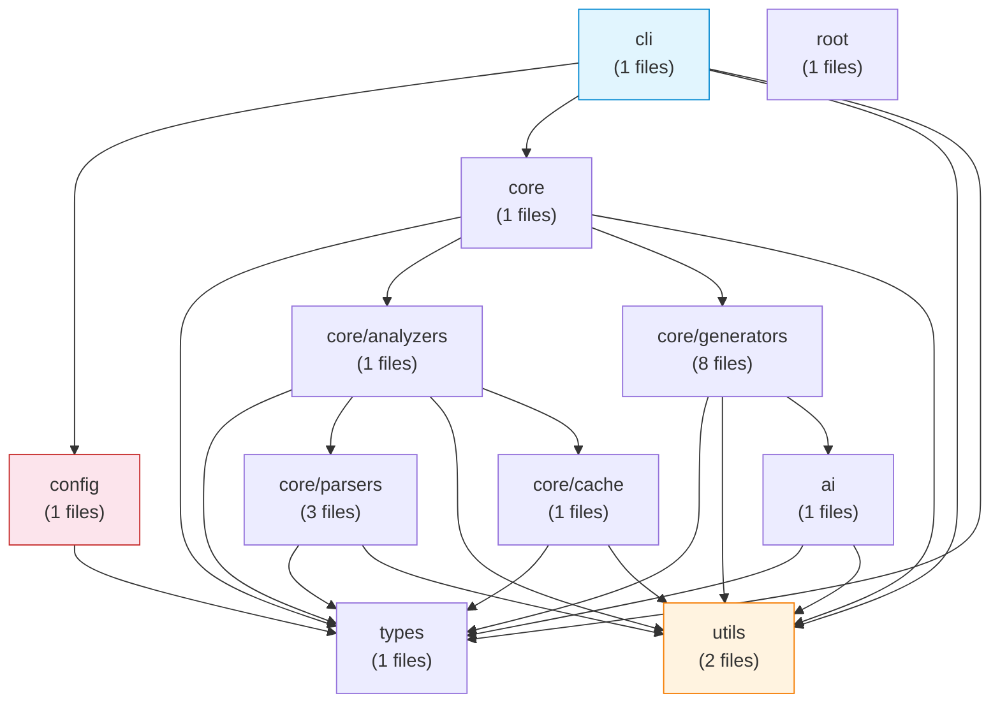
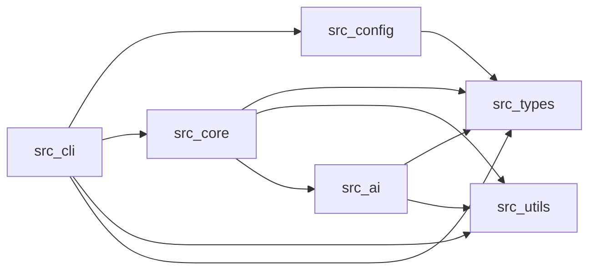
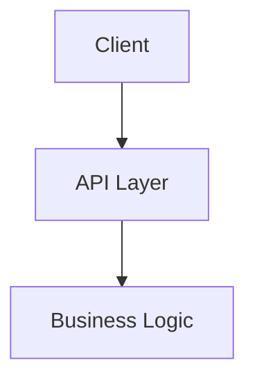

# Architecture — @docgen/cli

## Overview

[AI summarization disabled — enable in config to get human-readable descriptions]

## Module Relationships

## Modules

### ai

- **Role:** General
- **Files:** 1
- **Lines:** 218
- **Exports:** `summarizeProject`, `summarizeModule`, `summarizeFunction`, `explainArchitecture`, `staticModuleSummary`, `staticFunctionSummary`
- **Depends on:** `types`, `utils`
- **Used by:** `core/generators`

### cli

- **Role:** api
- **Files:** 1
- **Lines:** 299
- **Exports:** None
- **Depends on:** `config`, `core`, `utils`, `types`

### config

- **Role:** config
- **Files:** 1
- **Lines:** 92
- **Exports:** `DEFAULT_CONFIG`, `loadConfig`, `generateConfigFile`
- **Depends on:** `types`
- **Used by:** `cli`

### core/analyzers

- **Role:** General
- **Files:** 1
- **Lines:** 240
- **Exports:** `analyzeProject`
- **Depends on:** `types`, `core/parsers`, `utils`, `core/cache`
- **Used by:** `core`

### core/cache

- **Role:** General
- **Files:** 1
- **Lines:** 60
- **Exports:** `AnalysisCache`
- **Depends on:** `types`, `utils`
- **Used by:** `core/analyzers`

### core/generators

- **Role:** General
- **Files:** 8
- **Lines:** 964
- **Exports:** `generateAPIDocs`, `generateArchitectureDocs`, `generateFunctionDocs`, `generateIntegrationsDocs`, `generateModuleDocs`, `generateReadme`, `generateReadme`, `generateArchitectureDocs`, `generateModuleDocs`, `generateAPIDocs`, `generateFunctionDocs`, `generateIntegrationsDocs`, `generateSetupDocs`, `runGenerators`, `generateSetupDocs`
- **Depends on:** `types`, `utils`, `ai`
- **Used by:** `core`

### core/parsers

- **Role:** General
- **Files:** 3
- **Lines:** 600
- **Exports:** `parseJavaScriptFile`, `parsePythonFile`, `parseFile`, `canParse`, `getSupportedLanguages`, `parseJavaScriptFile`, `parsePythonFile`
- **Depends on:** `types`, `utils`
- **Used by:** `core/analyzers`

### core

- **Role:** General
- **Files:** 1
- **Lines:** 65
- **Exports:** `runPipeline`, `runAnalysisOnly`
- **Depends on:** `types`, `core/analyzers`, `core/generators`, `utils`
- **Used by:** `cli`

### root

- **Role:** General
- **Files:** 1
- **Lines:** 20
- **Exports:** `loadConfig`, `generateConfigFile`, `DEFAULT_CONFIG`, `runPipeline`, `runAnalysisOnly`, `analyzeProject`, `runGenerators`, `parseFile`, `canParse`, `getSupportedLanguages`, `AnalysisCache`

### types

- **Role:** General
- **Files:** 1
- **Lines:** 231
- **Exports:** None
- **Used by:** `ai`, `cli`, `config`, `core/analyzers`, `core/cache`, `core/generators`, `core/parsers`, `core`

### utils

- **Role:** utility
- **Files:** 2
- **Lines:** 180
- **Exports:** `findFiles`, `hashContent`, `hashFile`, `detectLanguage`, `readFileContent`, `fileExists`, `ensureDir`, `inferModuleName`, `countLines`, `truncate`, `detectFrameworks`, `parsePackageJson`, `Logger`, `logger`, `logger`, `setLogLevel`, `createModuleLogger`, `enableFileLogging`
- **Used by:** `ai`, `cli`, `core/analyzers`, `core/cache`, `core/generators`, `core/parsers`, `core`

## Dependency Graph

## External Integrations

### Framework

- **express** ^4.18.3

### Logging

- **winston** ^3.12.0

## Technology Stack

